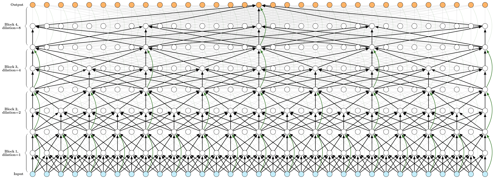

<div id="top"></div>
<!--
*** Thanks for checking out the Best-README-Template. If you have a suggestion
*** that would make this better, please fork the repo and create a pull request
*** or simply open an issue with the tag "enhancement".
*** Don't forget to give the project a star!
*** Thanks again! Now go create something AMAZING! :D
-->
<br />
<div align="center">
    <h2 align="center">Lightweight Diacritics Restoration<br />with<br />Dilated Convolutional Neural Networks</h2>
    <h3 align="center">
        <br />
            <a href="https://web.cs.elte.hu/~csbalint/diacritics/demo.html?lang=en&model_lang=HU" target="_blank"><strong>Try the model »</strong></a>
        <br />
    </h3>
</div>

<!-- ABOUT THE PROJECT -->
## About The Project

This project contains code for training and evaluating and inferring lightweight models for diacritics restoration.
This repository accompanies our <a href="https://arxiv.org/abs/2201.06757" target="_blank"><strong>paper</strong></a>.

### Summary

Diacritics restoration has become a ubiquitous task in the Latin-alphabet-based English-dominated Internet language environment.
In this repository, we provide a model built with small footprint 1D convolution-based approach, which works on character-level.
We find that solutions based on 1D dilated convolutional neural networks are competitive alternatives to models based on recursive neural networks or linguistic modeling for the task of diacritics restoration.
Our solution surpasses the performance of similarly sized models and is also competitive with larger models.
A special feature of our solution is that it even runs locally in a web browser. 
We also provide a working example of this browser-based implementation.
Our model is evaluated on different corpora, with emphasis on the Hungarian language.
We performed comparative measurements about the generalization power of the model in relation to three Hungarian corpora.
We also analyzed the errors to understand the limitation of corpus-based self-supervised training.

### Model architecture visualization
<p align="center">
  
</p>

### Built With

* [PyTorch](https://pytorch.org/)
* [ONNX.js](https://github.com/microsoft/onnxjs)
* [Hungarian Webcorpus 2.0](https://hlt.bme.hu/en/resources/webcorpus2)
* [Hunaccent](https://github.com/juditacs/hunaccent)
* [neptune.ai](https://neptune.ai/)

<!-- GETTING STARTED -->
## Getting Started

If you want to try out the model, the demo is available <a href="https://web.cs.elte.hu/~csbalint/diacritics/demo.html?lang=en&model_lang=HU"><strong>here</strong></a>.

For training the model:

### Prerequisites

The project logs both locally and to <a href="https://neptune.ai/"><strong>neptune.ai</strong></a>,
to use a neptune.ai an is neeeded. Logging to neptune can be disabled for individual experiments in the experiment's config, or globally by not providing an api token in the `neptune_cfg.yaml`.

Copy `neptune_cfg_template.yaml` to `neptune_cfg.yaml`, and fill out the appropriate details:
```yaml
project_qualified_name: 
api_token: 
offline_logging_dir: 
```

### Installation

For the moment refer to the example below and install the missing packages manually.

<!-- USAGE EXAMPLES -->
## Usage

The following command should work with the small example data provided in this repository. 

```sh
CUDA_VISIBLE_DEVICES=0,1 python run.py -c conf/example.yaml
```
